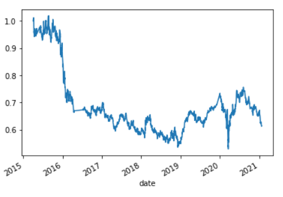
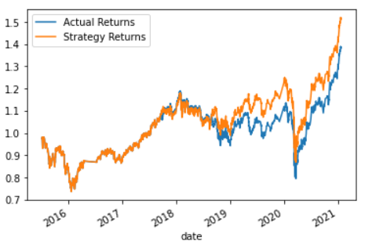
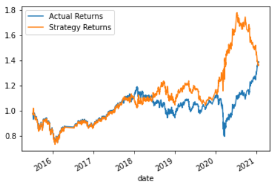
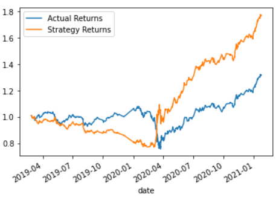

# Module 14: algo-trading

# Description

For this assignment we will be analyzing the price movement of a financial asset. In this regard, we were given financial data for what appears to be 15 minue time intervals from the period 21 January 2015 to 22 January 2021 - so about years worth of intra-day data. From this our task was to investigate the profiability of several trading strategies, some of which incorporated machine learning algorithms.

 

# Analysis

## Base Strategy
 For our base strategy, we applied a simple algorithm to buy the stock the next day if the stock had a positive return for the current day and conversely to short the stock the next day if the crrent days return was negative. Below is a graph of the trategy returns.

### Base Strategy Returns

From the above we see that the strategy performed well below par and would have lost cash over the period considered.

 

## SMA with Support Vector Strategy
Next we built on our strategy by looking at the 4 day (short window) and 100 day (long window) moving average price. These features were incorporated as our X variables in our suppor vector classification model with the y-variable being made up of the base strategy signals (i.e. buy if stock return was positive and short if negative). The training period used was 3 months with the remainder being used as out testing period. Th strategy performance is shown below: 

### sma_SVM Strategy Returns

From the above graph we see that our strategy performed very similar (slightly better) than a benchmark buy and hold strategy. With this as our base we then looked at using alternative models to derive a better strategy return than the SVM model.

 

## SMA with Random Forest Strategy
Using the same training and test inputs as the support vector machine model, we then ran these inpus through a Random Forest classification machine learning model. Results for this strategy against the benchmark buy and hold strategy is shown below:

### sma_RF Strategy Returns

From he above we see that the strategy performed very well, most notably over the crash in 2020 (ovid-19) BUT lost significantly over the last several months of 2021. So much so that over the period considered, the strategy performed in line with the benchmark buy and hold strategy. So, following this our next goal was to build on this and fine tune our model to produce higher returns.

 

## SMA with Tuned Random Forest Strategy
The first thing we did was to extend the training period from 3 months, which we felt was too low to 48 months (representing 4 years and 66% of the data) with the remaining 2 years (24 months) being used to test our strategy. We also adjusted the short sma window to 30 and the long sma window to 50 days and thereafter ran this in our Random Forest model. Strategy returns versus the benchmark buy and hold strategy is shown below:

### sma_tuned_RF Strategy Returns

As can be seen from the graph above, our tuned Random Forest model produced great results over the period considered and significantly outperformed the benchmark!